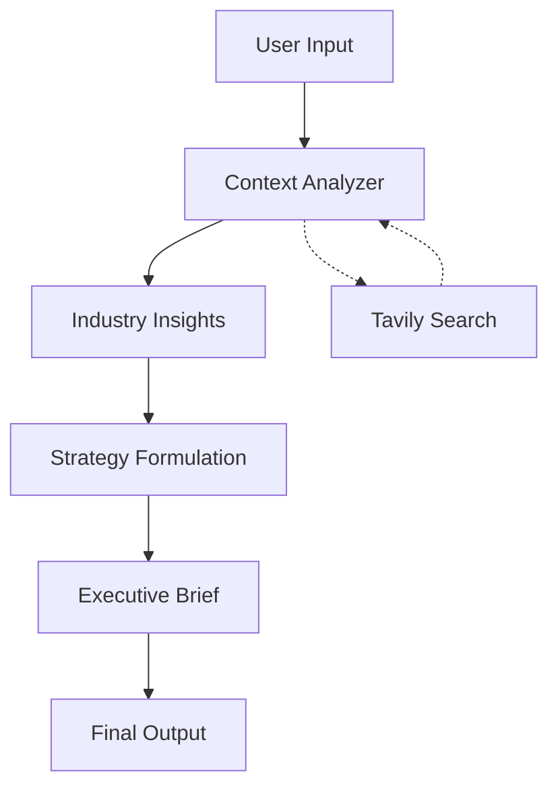

# 🚀 AI Meeting Preparation Agent

[](https://streamlit.io)
[](https://www.python.org/downloads/)
[](https://langchain-ai.github.io/langgraph/)
[](https://www.anthropic.com/)

> **Transform your meeting preparation with AI-powered intelligence**

An intelligent multi-agent system that revolutionizes meeting preparation by automatically generating comprehensive briefings, strategic insights, and actionable agendas tailored to your specific business context.

## ✨ Features

### 🤖 **Multi-Agent Intelligence**
- **Context Analyzer**: Gathers and synthesizes recent company news and updates
- **Industry Expert**: Provides deep industry analysis and competitive insights
- **Strategy Formulator**: Creates time-boxed agendas and strategic talking points
- **Executive Briefer**: Generates comprehensive executive summaries and Q&A prep

### 🔍 **Real-Time Research**
- Live web search integration via Tavily API
- Current market intelligence and competitor analysis
- Fresh news and press releases incorporation

### 📊 **Comprehensive Output**
- **Executive Summary**: One-page strategic overview
- **Meeting Agenda**: Time-boxed structure with key discussion points
- **Talking Points**: Data-backed conversation starters
- **Q&A Preparation**: Anticipated questions with strategic responses
- **Next Steps**: Actionable recommendations and follow-up items

## 🎯 Perfect For

- **Sales Meetings**: Prospect research and competitive positioning
- **Board Presentations**: Executive briefings with industry context  
- **Partnership Discussions**: Market analysis and strategic alignment
- **Client Check-ins**: Company updates and relationship management
- **Investment Pitches**: Due diligence and market validation

## 🚀 Quick Start

### Prerequisites

- Python 3.8 or higher
- Streamlit
- API keys for Anthropic Claude and Tavily

### Installation

1. **Clone the repository**
   ```bash
   git clone https://github.com/ek-sai/Meeting_Agent
   cd ai-meeting-agent
   ```

2. **Install dependencies**
   ```bash
   pip install streamlit langchain langgraph langchain-anthropic langchain-community
   ```

3. **Launch the application**
   ```bash
   streamlit run meeting_agent.py
   ```

### 🔐 API Keys Setup

#### 🧠 Anthropic Claude API
1. Visit [Anthropic Console](https://console.anthropic.com/)
2. Create an account or sign in
3. Navigate to API Keys section
4. Generate your API key
5. Enter in the app sidebar

#### 🔍 Tavily Search API
1. Visit [Tavily API](https://tavily.com/)
2. Sign up for an account
3. Get your API key from the dashboard
4. Enter in the app sidebar

## 📋 How to Use

### Step 1: Configure API Keys
Enter your Anthropic and Tavily API keys in the sidebar

### Step 2: Input Meeting Details
- **Company Name**: Target company or organization
- **Meeting Objective**: Primary goal or purpose
- **Attendees**: List participants and their roles
- **Duration**: Meeting length (15-180 minutes)
- **Focus Areas**: Specific topics or concerns

### Step 3: Generate Brief
Click "Prepare Meeting" and let the AI agents work their magic!

### Step 4: Review & Customize
Use the generated brief as your foundation and customize as needed

## 🏗️ Architecture



The application uses LangGraph to orchestrate a sequential workflow where each agent builds upon the previous agent's output, ensuring comprehensive and contextually relevant meeting preparation.

## 🛠️ Technology Stack

- **Frontend**: Streamlit
- **AI Framework**: LangChain + LangGraph
- **LLM**: Anthropic Claude 3.5 Sonnet
- **Web Search**: Tavily API
- **State Management**: TypedDict with LangGraph

## 📖 Example Output

The agent generates structured markdown output including:

```markdown
# Executive Brief: [Company Name]

## Meeting Overview
- **Objective**: [Your specified objective]
- **Duration**: [Meeting length]
- **Key Stakeholders**: [Attendee breakdown]

## Company Context
- Recent developments and news
- Product/service updates
- Market positioning

## Industry Analysis
- Current trends and opportunities
- Competitive landscape
- Market challenges

## Strategic Agenda
- [Time-boxed meeting structure]
- Key discussion points
- Speaker assignments

## Q&A Preparation
- Anticipated questions
- Strategic responses
- Supporting data points
```

## 🤝 Contributing

We welcome contributions! Please feel free to submit a Pull Request. For major changes, please open an issue first to discuss what you would like to change.

## 📄 License

This project is licensed under the MIT License - see the LICENSE file for details.

## 🆘 Support

If you encounter any issues or have questions:

1. Check the [Issues](../../issues) page
2. Review the API documentation for [Anthropic](https://docs.anthropic.com/) and [Tavily](https://docs.tavily.com/)
3. Open a new issue with detailed information about your problem

## 🎉 Acknowledgments

- [Anthropic](https://www.anthropic.com/) for Claude API
- [Tavily](https://tavily.com/) for web search capabilities
- [LangChain](https://langchain.com/) for the AI framework
- [Streamlit](https://streamlit.io/) for the web interface

---

**Ready to revolutionize your meeting preparation? Get started now!** 🚀
